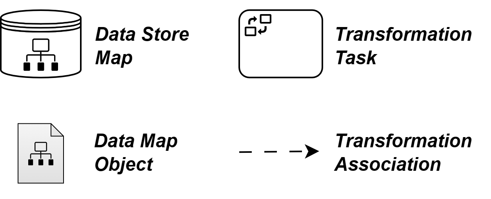

# Data Flow Plugin
Plugin which adds modelling elements to allow the explicit and executable modelling of the data flow.

## Overview
An overview of all modeling elements:

## Structure
- [DataFlow Plugin Object](../../../../components/bpmn-q/modeler-component/extensions/data-extension/DataFlowPlugin.js)
- [DataFlow Plugin Config](../../../../components/bpmn-q/modeler-component/extensions/data-extension/config/DataConfigManager.js)
- [Transformation Task Configurations](../../../../components/bpmn-q/modeler-component/extensions/data-extension/transf-task-configs)
- [DataFlow transformation Function](../../../../components/bpmn-q/modeler-component/extensions/data-extension/transformation/TransformationManager.js)
- bpmn-js Extension Module
  - [Replace Menu Provider](../../../../components/bpmn-q/modeler-component/extensions/data-extension/menu/DataFlowReplaceMenuProvider.js)
  - [Palette Provider](../../../../components/bpmn-q/modeler-component/extensions/data-extension/palette/DataFlowPaletteProvider.js)
  - [Properties Panel Provider](../../../../components/bpmn-q/modeler-component/extensions/data-extension/properties-panel/DataFlowPropertiesProvider.js)
  - [Rendering](../../../../components/bpmn-q/modeler-component/extensions/data-extension/rendering)
  - [Rules Provider](../../../../components/bpmn-q/modeler-component/extensions/data-extension/rules/DataFlowRulesProvider.js)

## DataMapObjects rules
The DataMapObjects can not be used together with the Loop, Parallel or Sequential BPMN marker. Therefore, the rules for
connecting DataMapObjects block incoming connections from tasks with one of these markers. Also, DataMapObjects can not
be used with BPMN Collection, so the respective marker is removed in the Camunda PopupHeader for DataMapObjects.