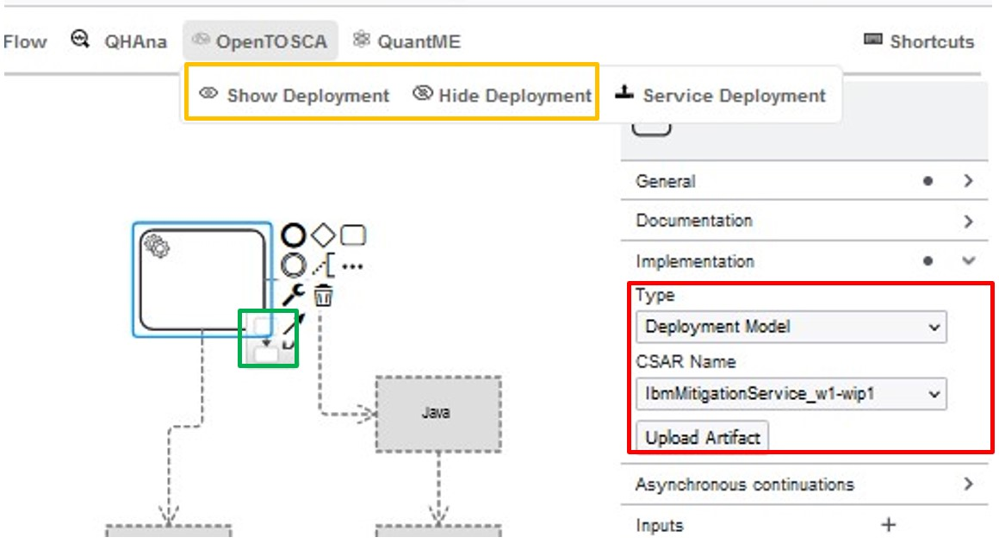

# OpenTOSCA Plugin
Plugin which integrates OpenTOSCA as a plugin. It allows attached deployment model to be deployed to OpenTOSCA.

## Attach deployment model to Service
In the Properties panel in the `Implementation` section set `Type` to `Deployment`, as shown in the red box. 
Afterwards the desired CSAR can be selected. Alternativly a Deployment model could be created on the fly by clicking the `Upload Artifact` button.
In the shown modal a Docker image reference or a local file can be specified. A click on the `Create` button creates the deployment model an attaches it to the service task.

## Visualize deployment models
On service tasks with an attached deployment model a button is shown which toggles the visualisation of the deployment model.
Alternatively a click on OpenTOSCA in the toolbar. Shows two buttons that when clicked show or hide all deployment visualisations at a single click.
Both options are shown in the green and orange boxes respectively.

The deployment model is only shown if a top level node is found. The top level node is detected in the following names 
* by a reference as in the TOSCA Tags. key: `top-node` value: `NODE_XYZ`.
* node without any incoming hosted-on. Only possible if just node with this condition is found.

## Structure
- [OpenTOSCA Plugin Object](../../../../components/bpmn-q/modeler-component/extensions/opentosca/OpenToscaPlugin.js)
- [OpenTOSCA Config](../../../../components/bpmn-q/modeler-component/extensions/opentosca/framework-config)
- [bpmn-js Extension Module](../../../../components/bpmn-q/modeler-component/extensions/opentosca/modeling)
- [Service Deployment to OpenTOSCA](../../../../components/bpmn-q/modeler-component/extensions/opentosca/ui/deployment)
- [Deployment Model Renderer](../../../../components/bpmn-q/modeler-component/extensions/opentosca/modeling/OpenToscaRenderer.js)