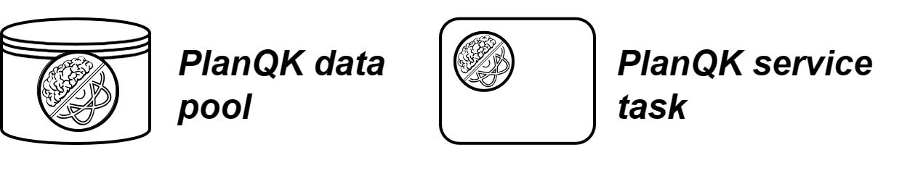

# The PlanQK Plugin
The PlanQK plugin adds the DataPool and PlanQKServiceTask modelling elements. It depends on the DataFlow plugin because
the DataPool extends the DataStoreMap. To use the PlanQK plugin, the DataFlow plugin must also be active.

## Overview
An overview of all modeling elements:


## Structure
- [PlanQK Plugin Object](../../../../components/bpmn-q/modeler-component/extensions/planqk/PlanQKPlugin.js)
- [PlanQK Transformation Function](../../../../components/bpmn-q/modeler-component/extensions/planqk/exec-completion/PlanQKServiceTaskCompletion.js)
- [Utilities](../../../../components/bpmn-q/modeler-component/extensions/planqk/utilities)
- bpmn-js Extension Module
  - [Properties Panel Providers](../../../../components/bpmn-q/modeler-component/extensions/planqk/propeties)
  - [Menu Provider](../../../../components/bpmn-q/modeler-component/extensions/planqk/PlanQKMenuProvider.js)
  - [Palette Provider](../../../../components/bpmn-q/modeler-component/extensions/planqk/PlanQKPaletteProvider.js)
  - [Rendering](../../../../components/bpmn-q/modeler-component/extensions/planqk/PlanQKRenderer.js)

## Configuration of the PlanQK Plugin
The config attribute of the PlanQK Plugin must have the following structure:

| Entry Name | Description                                                                                                                         |
| -------- |-------------------------------------------------------------------------------------------------------------------------------------|
| serviceEndpointBaseUrl | Base URL pointing to the endpoint for PlanQK services                                                                               |
| subscriptions | Array of subsriptions for PlanQK Services                                                                                           |
| oauthInfoByAppMap | Consumer key and consumer secret of PlanQK applications                                                                             |
| dataPools | Array PlanQK data pools. Each data pool consists of a name, an id, a link to the data pool on the PlanQK platform and a description |

A data pool has the following structure:

| Entry Name  | Description                                  |
|-------------|----------------------------------------------|
| name        | Name of the data pool                        |
| id          | ID of the data pool                          |
| link        | Link to the data pool on the PlanQK platform |
| description | Short description of the data pool           |

A subscription has the following structure:

| Entry Name  | Description                              |
|-------------|------------------------------------------|
| id          | ID of the subscription                   |
| application | Application the subscription contains to |
| api         | Api of the subscription                  |

An application has the following structure:

| Entry Name        | Description                                          |
|-------------------|------------------------------------------------------|
| id                | ID of the application                                |
| description       | Description of the application                       |
| attributes        | Attributes of the application                        |
| groups            | Groups of the application                            |
| name              | Name of the application                              |
| subscriptionCount | Amount of active subscription this application holds |

An API has the following structure:

| Entry Name        | Description                                       |
|-------------------|---------------------------------------------------|
| id                | ID of the API                                     |
| name              | Name of the API                                   |
| gatewayEndpoint   | URL to the API gateway                            |
| version           | Version string determining the version of the API |
| context           | Context URL of the API                            |

Example:
```javascript
const app1 = {
    id: 'app1',
    description: '',
    attributes: null,
    groups: [],
    name: 'Example App',
    subscriptionCount: 2
};
const api1 = {
    id: 'api1',
    name: 'Example API',
    gatewayEndpoint: 'www.example-gateway.de/api1',
    version: 'v1',
    context: '/api1'
};
const sub1 = {id: 'sub1', application: app1, api: api1};

const dp1 = {
    name: 'Anomaly Detection: Bars & Stipes Dataset ',
    id: '2a7d74a6-0fb5-400a-8f0c-7125aef5613e',
    link: 'https://platform.planqk.de/datapools/2a7d74a6-0fb5-400a-8f0c-7125aef5613e/',
    description: 'A synthetic dataset for the anomaly detection. There are two version of the dataset, a larger version consisting of 3x3 pixel images of bars and stripes and a small version of 2x2 pixel images. We provide pretrained models for both of these datasets to be used with the AnoGan service.',
};

const modelerComponent = document.querySelector('quantum-workflow');
modelerComponent.pluginConfigs = [
    // ...
    {
        name: 'planqk',
        config: {
            serviceEndpointBaseUrl: 'http://dummy.com',
            subscriptions: [sub1],
            oauthInfoByAppMap: {
                app1: {consumerKey: 'app1ConsumerKey', consumerSecret: 'app1ConsumerSecret'},
            },
            dataPools: [dp1],
        }
    },
    // ...
]
```