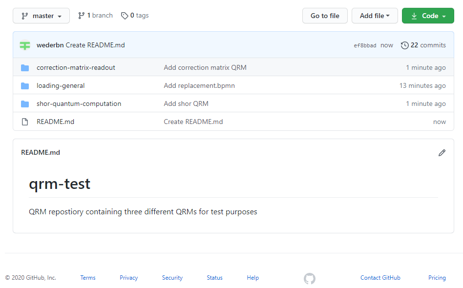
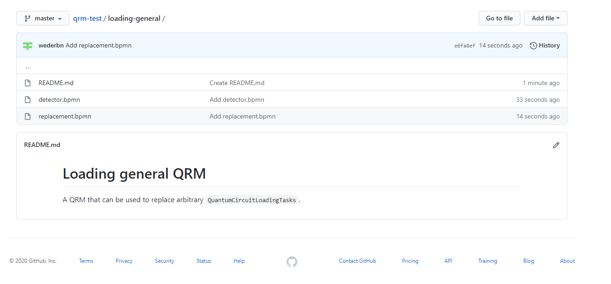
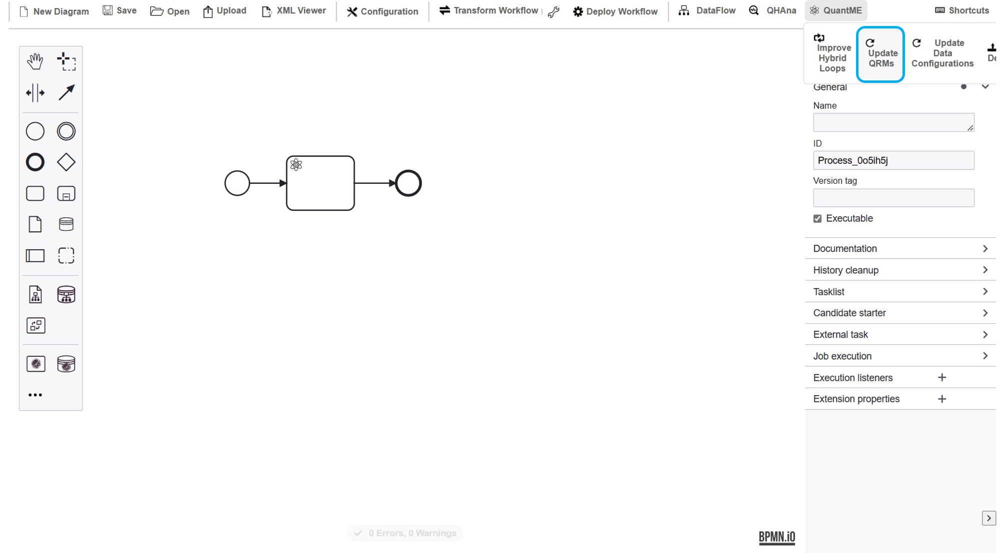

# QRM Repository

In the following the structure of a QRM repository as well as its configuration and usage is shown.

### Configuration

The QRM repository must be an accessible Github repository. If the repository is private or you want to increase the rate limit, a GitHub token has to be provided with the according rights (see [here](https://docs.github.com/en/authentication/keeping-your-account-and-data-secure/managing-your-personal-access-tokens))
It can be configured using the configuration window or environment variables.
The `githubUsername` should be used to configure the username or organisation name under which the Github repository is located.
Furthermore, `githubRepositoryName` has to specify the name of the Github repository.
Finally, `githubRepositoryPath` can be used to specify a subfolder in the Github repository containing the QRMs.
It not set, the root folder is used to retrieve the QRMs.

### Structure

The QRM repository can contain an arbitrary number of QRMs, each of which has to be located in a separate folder in the Github repository.
In the following, an example QRM repository containing three QRMs is shown:

Each of the folders has to contain at least the two files `detector.bpmn` and `replacement.bpmn`, which represent the QRM.
If one of the two files is missing or contains invalid content, the QRM is ignored during transformation.
Additionally, other files can be added to the folders, e.g., a readme file describing the QRM:

### Updating the QRM repository

When starting the workflow modeler, the QRM repository is loaded once.
However, if the repository is changed during runtime of the framework, the QRMs have to be reloaded.
For this, use the `Plugins` menu entry, go to `QuantME`, and click on the `Update from QRM repository` button:

If the defined Github username and repository name are invalid and result in an error when loading the QRMs, a notification is displayed in the modeler and the configuration should be fixed.