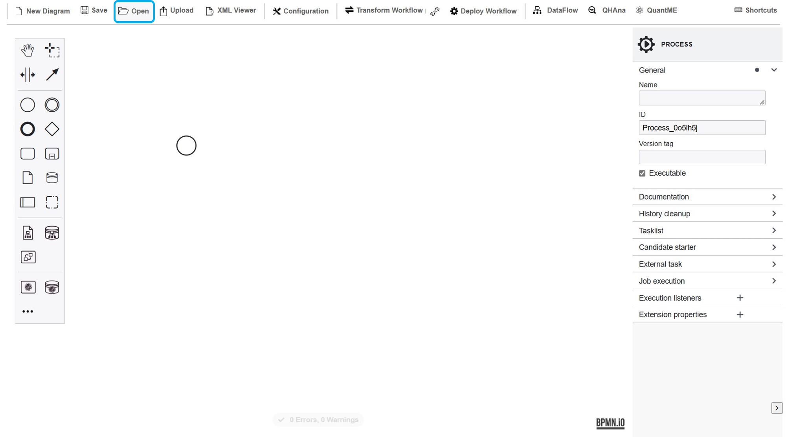
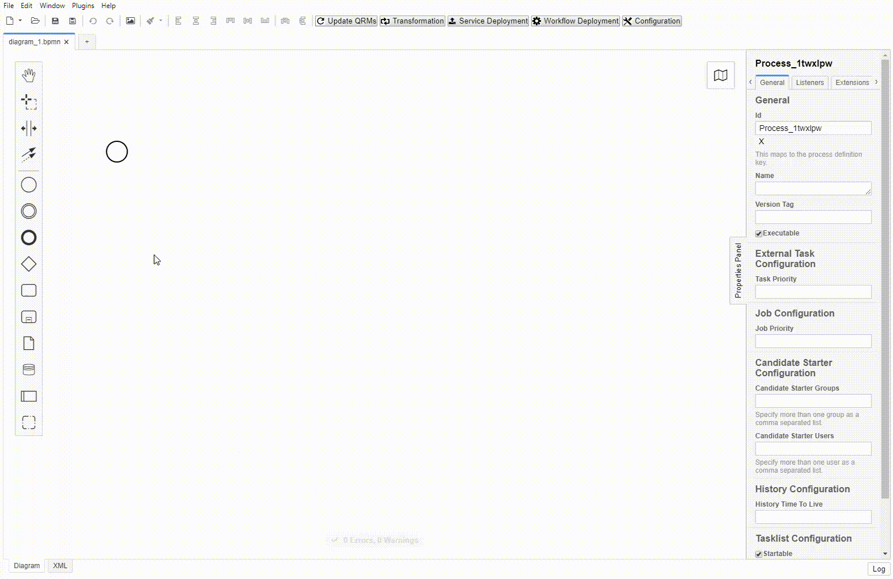
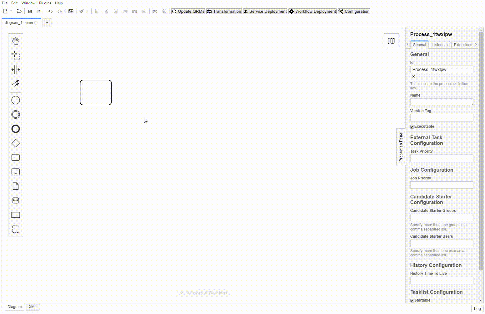
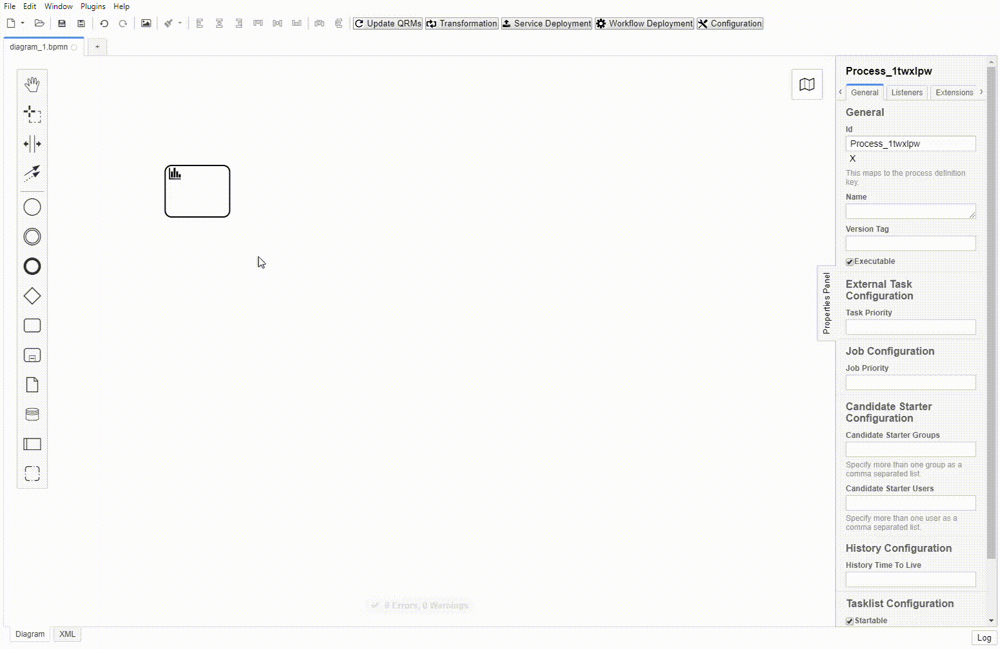
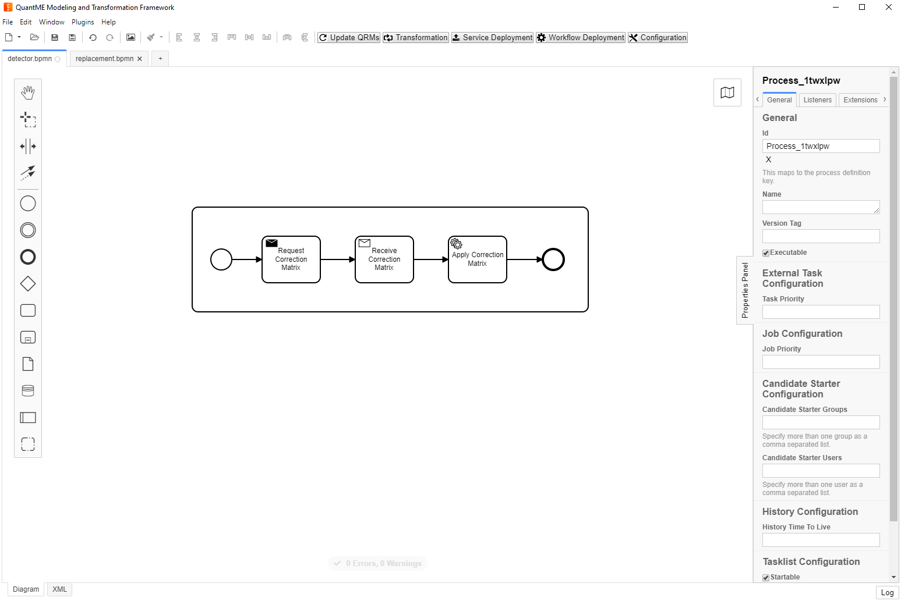
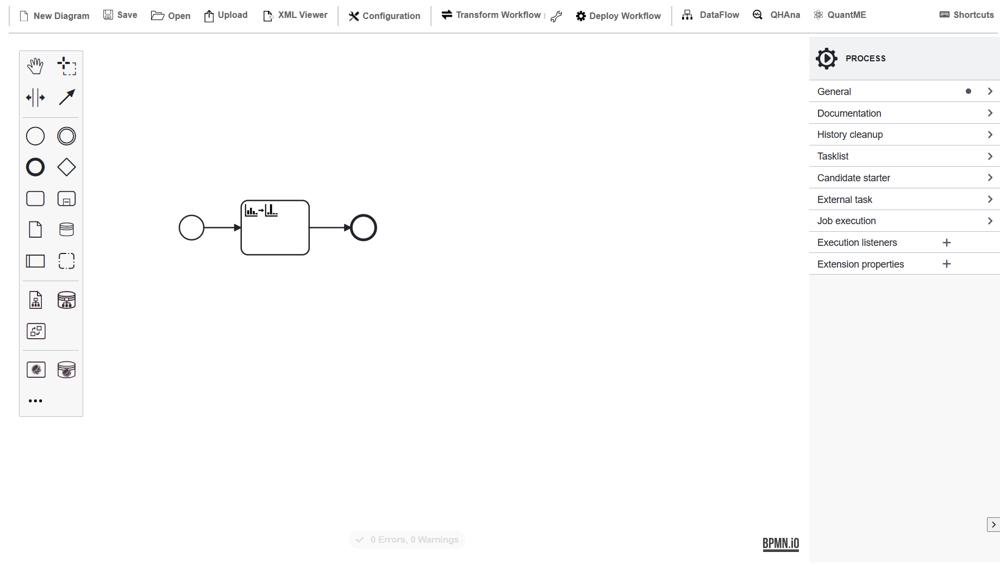
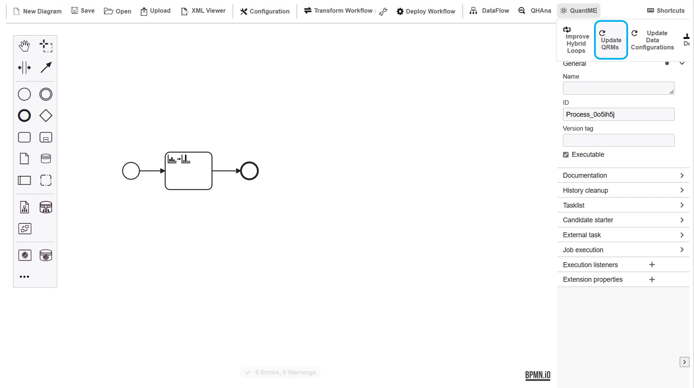
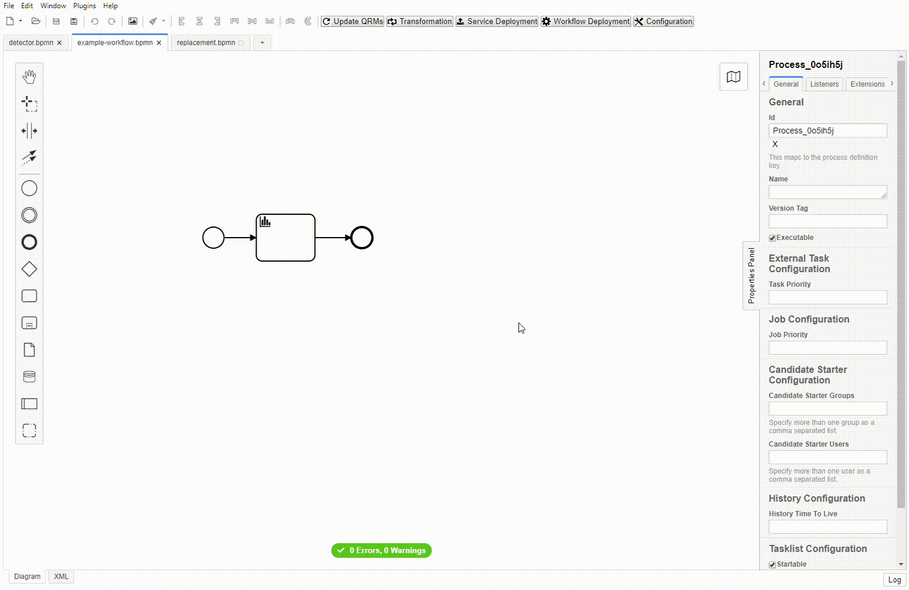

# Tutorial

In the following, it is described how to set up the workflow modeler, create a [QRM repository](../QRM-Repository) with one [QRM](../QRM), and use it to transform an example QuantME workflow to a workflow containing only native BPMN modeling constructs.

1. Clone the workflow modeler: 

    ```git clone https://github.com/PlanQK/workflow-modeler```

2. Create a Github repository for your QRMs. 
In the following we will assume the repository is available under the `UST-QuAntiL` Github organization and has the repository name `qrm-test`.
Please adapt these values to your setup in the following steps.

3. Configure the workflow modeler to use the created QRM repository using environment variables:
- Navigate to the webpack-config file that is located [here](../../../../../components/bpmn-q/webpack.config.js).
Insert the user/organisation name and repository name:

  ```JS
  QRM_USERNAME: 'UST-QuAntiL',
  QRM_REPONAME: 'qrm-test'
  ```
- Alternatively, you can also configure the QRM repository after starting the workflow modeler using the `Configuration Tab` in the toolbar. 

4. Start the workflow modeler:

- Please make sure to execute the following commands using a Posix environment. 
On Windows, that is Git Bash or WSL.

- Navigate to the bpmn-q folder and install the dependencies using ```npm install``` and ```npm run dev```.
Then, the workflow modeler will start automatically.

5. Use the workflow modeler to create a QRM (detector and replacement fragment):

* First, create the detector for the QRM:

  - Open a new BPMN diagram:

    <kbd></kbd>

  - Delete the start event and add a new task:

    <kbd></kbd>

  - Replace the task by a task of type ```ReadoutErrorMitigationTask```

    <kbd></kbd>

  - Set the attributes of the detector:
  
    <kbd></kbd>
  
    In this example, we want to create a replacement fragment that can apply the _correction matrix_ unfolding technique to calculations performed on _ibmq_rome_ or _ibmq_london_. 
    Therefore, we define ```Correction Matrix``` for the _unfolding technique_ attribute of the task, ```IBMQ``` for the _provider_ attribute, and the list ```ibmq_rome, ibmq_london``` for the _QPU_ attribute.
    Our implementation will handle arbitrary values for the _max age_ attribute, thus, we add a wildcard (```*```) for this attribute.
    Note: For workflows only numerical values are allowed for the _max age_ attribute. 
    Therefore, the wildcard is marked as faulty.
    However, this does not apply to detectors.

  - Store the detector under the name ```detector.bpmn``` in a new folder of the QRM repository and commit it.
    The detector for this example in XML format can be found [here](../QRM/detector.bpmn).

* Second, create the replacement fragment:

  - Create a new BPMN diagram
  
  - Add a subprocess and three contained tasks as depicted below:
  
    <kbd></kbd>
    
    Store the created replacement fragment under the name ```replacement.bpmn``` in the folder of the QRM repository and commit it.
    The replacement fragment for this example in XML format can be found [here](../QRM/replacement.bpmn).
    
    In this example, we assume that the different tasks are implemented as [external tasks](https://docs.camunda.org/manual/7.8/user-guide/process-engine/external-tasks/).
    This means when the task is executed, the Camunda engine publishes a work item in a list, which can be polled and performed by some consumer service.
    However, the kind of implementation of tasks does not affect the transformation method and is up to the QRM modeler.
    
6. Create the QuantME workflow:

  * Now a QuantME workflow can be modeled that uses a ReadoutErrorMitigationTask.
    Thus, it can later be transformed into a workflow using only native BPMN modeling constructs.
    For the sake of simplicity, we use a workflow with only one ReadoutErrorMitigationTask in this example.
    Of course, the execution of just that task is not useful, but additional tasks and corresponding QRMs can be added in the same way.
    Thus, our example workflow is depicted in the following figure:
    
    <kbd></kbd>
    
    Please note the defined attributes of the ReadoutErrorMitigationTask as shown in the bottom right corner of the figure.
    The example workflow in XML format can be found [here](./example-workflow.bpmn).
    
  * Update the QRM repository: 
    The QRM repository is loaded into the workflow modeler at startup.
    Therefore, if there are updates in the repository during the runtime of the framework, the QRM repository has to be reloaded.
    Furthermore, an update is also needed after updating the QRM repository configuration during runtime.
    This can be requested in the toolbar: 
    
    <kbd></kbd>
    
    Note: The Github API takes some time to return the updated files.
    Thus, if you experience some issues, wait some time and then update the QRM repository again.
    
  * Then, the QuantME workflow model can be transformed to a native workflow model:
  
    <kbd></kbd>
    
7. Finally, the resulting workflow model can be manually adapted and deployed to a BPMN engine, such as the [Camunda engine](https://camunda.com/products/camunda-bpm/bpmn-engine/) to execute it.
