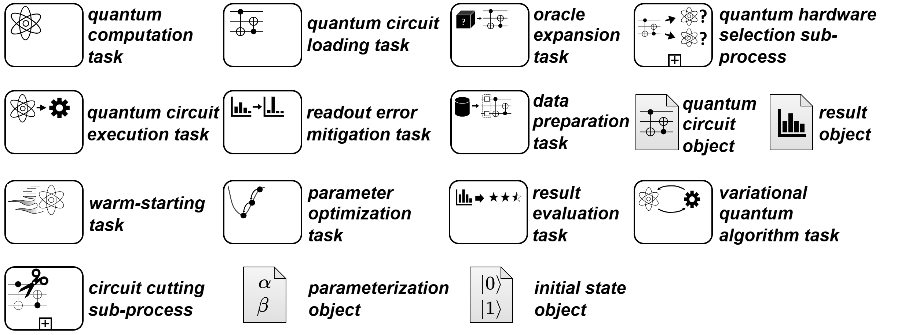

# QuantME Plugin
Plugin which integrates the [QuantME Transformation Framework](https://github.com/UST-QuAntiL/QuantME-TransformationFramework/tree/develop) as a plugin.

### [Quantum4BPMN](https://github.com/UST-QuAntiL/QuantME-Quantum4BPMN)

Formal definition of _Quantum4BPMN_, which is an extension of BPMN that supports QuantME. An overview of all extension elements:

### [QuantME Replacement Models (QRMs)](./QRM)

This shows the concept of QuantME Replacement Models (QRMs) and how they are used in the framework.

### [QRM Repository](./QRM-Repository)

Information about how to configure the workflow modeler to use a certain QRM repository as well as the structure of QRM repositories.

### [Tutorial](./Tutorial)

A short example with different steps to create a QRM and use it to transform a QuantME workflow to a native BPMN workflow.

### [Analysis and Rewrite](./Analysis-and-Rewrite)

Information about how to analyze and rewrite quantum workflows to benefit from hybrid runtimes, e.g., the Qiskit Runtime or Amazon Braket Hybrid Jobs.

## Structure
- [QuantME Plugin Object](../../../../components/bpmn-q/modeler-component/extensions/quantme/QuantMEPlugin.js)
- [QuantME Config](../../../../components/bpmn-q/modeler-component/extensions/quantme/framework-config)
- [bpmn-js Extension Module](../../../../components/bpmn-q/modeler-component/extensions/quantme/modeling)
- [QuantME Data Objects Configurations](../../../../components/bpmn-q/modeler-component/extensions/quantme/configurations)
- [QuantME Transformation Function](../../../../components/bpmn-q/modeler-component/extensions/quantme/replacement/QuantMETransformator.js)
- [QRM Manager](../../../../components/bpmn-q/modeler-component/extensions/quantme/qrm-manager/qrm-handler.js)
- [Hybrid Loop Detection and Rewrite](../../../../components/bpmn-q/modeler-component/extensions/quantme/ui/adaptation)
- [Service Deployment to OpenTOSCA](../../../../components/bpmn-q/modeler-component/extensions/quantme/ui/deployment)
- [Utilities](../../../../components/bpmn-q/modeler-component/extensions/quantme/utilities)