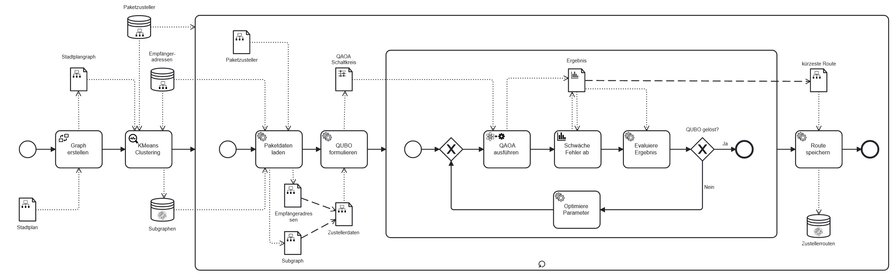

# Use Case Example
A use case modelled as a workflow modelled with the modelling extensions of the plugin of the quantum workflow modeler 
can be found in [package-delivery-route.bpmn](./package-delivery-route.bpmn). This workflow diagram can only be opened 
in the quantum workflow modeler due to ist custom model elements which are not defined in the BPMN standard.

A visualization of the workflow is displayed in the following figure:
